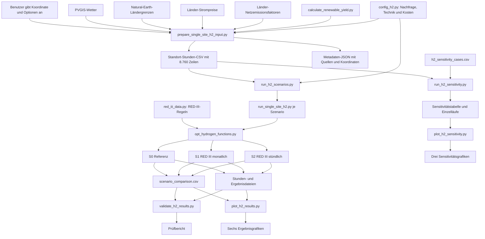

# Das H2-Modell von Anfang bis Ende einfach erklärt

## 1. Zweck dieser Anleitung

Diese Anleitung erklärt den vollständigen Weg durch das Modell, ohne Python-, Optimierungs- oder Energietechnikkenntnisse vorauszusetzen. Nach dem Lesen soll verständlich sein:

- welche Informationen am Anfang benötigt werden,
- woher diese Informationen stammen,
- welches Skript welche Aufgabe übernimmt,
- welche Datei dabei erzeugt wird,
- welches nächste Skript diese Datei verwendet,
- wo die endgültigen Tabellen und Abbildungen liegen,
- welche Aussagen aus den Ergebnissen zulässig sind.

Das Modell untersucht die kostenminimale Produktion von gasförmigem Wasserstoff an einem frei wählbaren Einzelstandort. Ein Lauf betrachtet immer genau eine Koordinate. Mehrere Standorte können nacheinander mit demselben Ablauf gerechnet werden. Die Forschungsarbeit verwendet die Koordinate **−21,0800° / 14,1610° in Namibia** als Fallstudie und ordnet sie dem Mittelpunkt eines 1°-Pixels bei **−21,5° / 14,5°** zu.

## 2. Das Modell in einem Satz

Aus Koordinate, Wetter, Strompreis, Netzemissionen, Wasserstoffnachfrage, Technik- und Kostendaten berechnet das Modell, wie viel PV, Wind, Elektrolyseur, Kompressor und H2-Speicher gebaut und wie diese Anlagen in jeder Stunde betrieben werden müssen, damit der Wasserstoff möglichst günstig und unter den untersuchten RED-III-Bedingungen bereitgestellt wird.

## 3. Der gesamte Datenfluss als Bild



Die Pfeile bedeuten: Der Output links wird vom nächsten Schritt als Input verwendet. Die Metadaten-JSON aus der Standortaufbereitung dient vor allem der Nachvollziehbarkeit; der Solver liest für die Rechnung die Stunden-CSV.

## 4. Wichtige Begriffe

| Begriff | Einfache Bedeutung |
|---|---|
| Koordinate | Breiten- und Längengrad eines Standorts |
| Pixel | Eine Rasterzelle; beim 1°-Raster wird mit deren Mittelpunkt gerechnet |
| Kapazitätsfaktor | Zahl zwischen 0 und 1 für den verfügbaren Anteil der installierten PV- oder Windleistung |
| Kapazität | Größe einer Anlage, beispielsweise 50 MW Elektrolyseurleistung |
| WACC | Kalkulationszins für die Finanzierung; ein höherer WACC verteuert kapitalintensive Anlagen |
| CAPEX | Investitionskosten für den Bau einer Anlage |
| OPEX | laufende Betriebs- und Instandhaltungskosten |
| LCOH | annualisierte Kosten je bereitgestelltem Kilogramm Wasserstoff |
| Solver | Rechenprogramm, das aus allen zulässigen Lösungen die kostengünstigste auswählt |
| Szenario | festgelegte Kombination von Regeln, beispielsweise monatliche oder stündliche Korrelation |
| TMY | typisches meteorologisches Jahr aus repräsentativen Monaten mehrerer Wetterjahre |
| CSV | Texttabelle, die beispielsweise mit Excel oder pandas geöffnet werden kann |
| JSON | strukturierte Textdatei für Quellen, Parameter und Metadaten |
| PNG | Bilddatei |
| SHA-256-Hash | digitaler Fingerabdruck; gleiche Hashes zeigen dieselbe Eingabedatei |

## 5. Dateien vor dem ersten Lauf

### 5.1 Python-Dateien

| Datei | Aufgabe | Direkt starten? |
|---|---|---|
| `prepare_single_site_h2_input.py` | erstellt die Standort-Stunden-CSV | ja |
| `run_single_site_h2.py` | rechnet genau ein ausgewähltes Szenario | bei Einzelanalysen ja |
| `run_h2_scenarios.py` | rechnet automatisch S0, S1 und S2 | ja, normaler Haupteinstieg |
| `validate_h2_results.py` | prüft gespeicherte Ergebnisse unabhängig nach | ja |
| `plot_h2_results.py` | erstellt sechs Hauptabbildungen | ja |
| `run_h2_sensitivity.py` | rechnet die Einzelfaktor-Sensitivitätsanalyse | optional ja |
| `plot_h2_sensitivity.py` | erstellt drei Sensitivitätsabbildungen | optional ja |
| `config_h2.py` | enthält Nachfrage, Technik-, Kosten- und Zeitannahmen | nein, wird importiert |
| `h2_input_data.py` | definiert und prüft das Stundenformat | nein, wird importiert |
| `calculate_renewable_yield.py` | berechnet PV- und Windprofile aus Wetterdaten | nein, wird importiert |
| `opt_hydrogen_functions.py` | enthält das mathematische Optimierungsmodell | nein, wird importiert |
| `red_iii_data.py` | enthält RED-III-Parameter und unabhängige Prüfregeln | nein, wird importiert |

### 5.2 Quelldaten unter `input_data/`

| Datei oder Ordner | Inhalt und Herkunft | Verwendung |
|---|---|---|
| `gpp_2025_country_pages_numeric.json` | Gewerbestrompreis-Proxys von GlobalPetrolPrices mit Quell-URLs und EUR-Umrechnung | automatische Preiswahl in der Standortaufbereitung |
| `h2_country_factors.json` | belegte Netzemissionsfaktoren; Namibia: 220 kg CO2e/MWh für 2024 aus dem Electricity Control Board of Namibia | automatische Emissionsfaktorwahl |
| `ne_110m_admin_0_countries/` | Ländergrenzen von Natural Earth im Maßstab 1:110 Millionen | automatische Länderzuordnung ohne `--country-code` |
| `h2_sensitivity_cases.csv` | 16 Sensitivitätsfälle | `run_h2_sensitivity.py` |
| `SteffenEtAl2025_WACC_database.csv` | wissenschaftliche WACC-Quelldaten für Länder und Regionen | Dokumentations- und Parameterquelle |
| `technology_costs.xlsx` | ursprüngliche Kosten- und Vergleichsdaten | Dokumentations- und Vergleichsquelle |

Die letzten beiden Dateien werden im normalen Namibia-Lauf **nicht automatisch geöffnet**. Der Namibia-WACC wird ausdrücklich über die Kommandozeile übergeben. Die aktuellen technischen und wirtschaftlichen Basiswerte stehen mit Einheit und Quelle in `config_h2.py` und später in `run_metadata.json`.

### 5.3 Weitere Dateien und Ordner

| Datei oder Ordner | Bedeutung |
|---|---|
| `environment_h2.yml` | benötigte Python-Pakete für eine reproduzierbare Conda-Umgebung |
| `tests/` | 163 automatische Tests für Daten, Gleichungen, Solver, RED III, Abbildungen und Validierung |
| `outputs_h2/` | lokale Eingaben, Rechenergebnisse, Prüfberichte und Abbildungen |
| `README.md` | wissenschaftlicher Modellüberblick |
| `MODELLUEBERGABE.md` | kurze Installations- und Ausführungsanleitung |
| `Forschungsarbeitplan.md` | fachlicher Rahmen und dokumentierte Modellentscheidungen |

## 6. Schritt 0: Arbeitsumgebung vorbereiten

Auf einem neuen Rechner wird in der Anaconda Prompt eingegeben:

```bat
cd /d C:\Forschungsarbeit\Opt_H2_Meric-h2
conda env create -f environment_h2.yml
conda activate h2-model
python --version
```

Bei einer bereits vorhandenen Umgebung entfällt `conda env create`. Erwartet wird Python 3.11. In Windows-CMD müssen die folgenden Modellbefehle jeweils vollständig in **einer Zeile** stehen. Ein Backtick gehört dort nicht an das Zeilenende.

## 7. Schritt 1: Standortdaten erzeugen

### 7.1 Skript und Benutzereingaben

Gestartet wird `prepare_single_site_h2_input.py`. Mindestens benötigt es:

- `--latitude`: Breitengrad,
- `--longitude`: Längengrad,
- `--output`: Pfad der Stunden-CSV.

Der vollständige Namibia-Befehl lautet:

```bat
python prepare_single_site_h2_input.py --latitude -21.0800 --longitude 14.1610 --country-code NA --spatial-resolution 1 --output outputs_h2\namibia_case_study\namibia_input_1deg.csv --overwrite
```

### 7.2 Interner Ablauf

1. Die Koordinate wird geprüft.
2. `--spatial-resolution 1` bildet −21,0800° / 14,1610° auf den Pixelmittelpunkt −21,5° / 14,5° ab.
3. `pvlib` ruft ein PVGIS-TMY ab. PVGIS wählt repräsentative Monate aus 2007 bis 2016.
4. Die 8.760 TMY-Stunden werden als technisches Nicht-Schaltjahr 2025 in UTC dargestellt. Der Index 2025 bedeutet nicht, dass alle Wetterwerte 2025 gemessen wurden.
5. `calculate_renewable_yield.py` erzeugt PV- und Wind-Kapazitätsfaktoren. Wind wird mit einer Vestas V90/2000 bei 80 m Nabenhöhe modelliert.
6. Ohne `--country-code` wird das Land aus Natural Earth bestimmt; hier wird Namibia ausdrücklich als `NA` übergeben.
7. Ohne eigenen Strompreis wird der Namibia-Wert aus `gpp_2025_country_pages_numeric.json` gelesen: 128 EUR/MWh, konstant für alle Stunden.
8. Ohne eigenen Netzemissionsfaktor wird der Namibia-Wert aus `h2_country_factors.json` gelesen: 220 kg CO2e/MWh, konstant für alle Stunden.
9. `config_h2.py` liefert 10.000 kg H2 pro Tag, also 416,6667 kg H2 pro Stunde.
10. `h2_input_data.py` prüft Spalten, Einheiten, fehlende Werte, stündliche Zeitfolge und Wertebereiche.

Eigene Daten können die Standardquellen ersetzen:

| Option | Wirkung |
|---|---|
| `--weather-file DATEI.csv` | lokale Wetterdaten statt PVGIS |
| `--electricity-price WERT` | eigener konstanter Preis in EUR/MWh |
| `--electricity-price-file DATEI.csv` | eigene stündliche Preisreihe |
| `--grid-emission-factor WERT` | eigener konstanter Netzfaktor in kg CO2e/MWh |
| `--grid-emission-file DATEI.csv` | eigene stündliche Emissionsreihe |
| `--h2-demand-kg-per-day WERT` | andere tägliche H2-Nachfrage |

### 7.3 Output

```text
outputs_h2/
└── namibia_case_study/
    ├── namibia_input_1deg.csv
    └── namibia_input_1deg_metadata.json
```

Die CSV enthält eine Zeile je Stunde:

| Spalte | Einheit | Bedeutung |
|---|---|---|
| `timestamp` | UTC | Zeitpunkt |
| `pv_capacity_factor` | 0 bis 1 | verfügbare PV-Erzeugung je MW PV |
| `wind_capacity_factor` | 0 bis 1 | verfügbare Winderzeugung je MW Wind |
| `electricity_price` | EUR/MWh | Preis des Netzstrombezugs |
| `grid_emission_factor` | kg CO2e/MWh | Emissionen des Netzstroms |
| `h2_demand` | kg H2/h | zu liefernder Wasserstoff |

Die JSON-Datei dokumentiert Koordinaten, Entfernung zum Modellpunkt, Höhe, Land, PVGIS-Monate, Quellen, Einheiten, Einschränkungen und den SHA-256-Hash der CSV.

### 7.4 Weitergabe

`namibia_input_1deg.csv` ist der zentrale Standortdatensatz. `run_h2_scenarios.py`, `run_single_site_h2.py` und `run_h2_sensitivity.py` lesen diese Datei. Die Metadaten-JSON dient der Dokumentation und wird nicht als numerischer Solverinput benötigt.

## 8. Schritt 2: Modellannahmen laden

`config_h2.py` wird intern importiert und nicht direkt gestartet. Beim Import öffnet die Datei keine Datendateien. Sie enthält Parameter mit Wert, Einheit, Quelle und Bezugsjahr.

| Größe | Basiswert | Herkunft |
|---|---:|---|
| H2-Nachfrage | 10.000 kg/Tag | Brandt et al. (2024) |
| Zeitraum | 8.760 Stunden | Modellfestlegung nach Brandt et al. (2024) |
| PV-CAPEX | 921 EUR 2023/kW | Brandt et al. (2024) |
| Wind-CAPEX | 1.779,50 EUR 2023/kW | Brandt et al. (2024) |
| Elektrolyseur-CAPEX | 1.297 EUR 2023/kW | Brandt et al. (2024) |
| Elektrolyseur-Strombedarf | 52,5 kWh/kg H2 | Brandt et al. (2024) |
| Wasserverbrauch | 14 kg Wasser/kg H2 | Brandt et al. (2024) |
| Elektrolyseur-Ausgang | 30 bar | Brandt et al. (2024) |
| Kompressor-Ausgang | 350 bar | Brandt et al. (2024) |
| Druckspeicher | 300 bar | Brandt et al. (2024) |
| Kompressorverlust | 0,5 % H2 | Brandt et al. (2024) |

Der Literatur-Basisfall besitzt unterschiedliche WACC-Werte je Technik. Für Namibia überschreibt der Szenarienbefehl sie mit `--uniform-real-wacc 0.11` einheitlich auf 11 %. Der verwendete Wert und seine Beschreibung werden in den Laufmetadaten gespeichert.

## 9. Schritt 3: RED-III-Regeln bereitstellen

`red_iii_data.py` wird von `opt_hydrogen_functions.py` importiert. Die Datei basiert auf:

- Richtlinie (EU) 2023/2413,
- Delegierter Verordnung (EU) 2023/1184,
- Delegierter Verordnung (EU) 2023/1185.

Das Modell verwendet maximal **28,2 g CO2e/MJ H2**, entsprechend **3,384 kg CO2e/kg H2** bei 120 MJ/kg H2. Die Datei enthält außerdem eine unabhängige Prüfung der zeitlichen Korrelation und des implementierten THG-Teils.

Zusätzlichkeit, geografische Korrelation, Gebotszone, Vertrag und eindeutige Allokation bleiben externe Nachweise. Das Modell ist keine vollständige rechtliche Zertifizierung.

## 10. Schritt 4: Mathematische Optimierung

`opt_hydrogen_functions.py` erhält intern die validierte Stunden-Tabelle und die Modellkonfiguration. Es wird normalerweise nicht direkt gestartet.

Der Solver wählt die kostenminimalen Größen von:

- PV-Anlage,
- Windanlage,
- PEM-Elektrolyseur,
- Kompressor,
- H2-Druckspeicher.

Für jede Stunde entscheidet er zusätzlich Erzeugung, Eigenverbrauch, Abregelung, Netzbezug, Elektrolyse- und Kompressorbetrieb, H2-Produktion und Speicherfüllstand.

Immer erfüllt sein müssen:

- stündliche Strombilanz,
- Grenzen der verfügbaren PV- und Windenergie,
- Kapazitätsgrenzen aller Anlagen,
- stündliche H2-Bilanz einschließlich Verdichtungsverlust,
- zyklische Speicherbilanz zwischen Jahresende und Jahresanfang,
- vollständige Deckung der H2-Nachfrage,
- je Szenario die betreffende RED-III-Zeitregel.

Minimiert werden annualisierte Investitionskosten, fixe und variable Betriebskosten, Netzstromkosten und Wasserkosten. Danach gilt:

```text
LCOH = annualisierte Gesamtkosten / jährlich gelieferte H2-Menge
```

Der Jahreslauf verwendet SciPy/HiGHS. Gurobi steht für kleine Vergleichstests zur Verfügung.

## 11. Schritt 5: Ein Szenario rechnen

`run_single_site_h2.py` verbindet Stunden-CSV und Optimierungskern:

```bat
python run_single_site_h2.py --input outputs_h2\namibia_case_study\namibia_input_1deg.csv --scenario reference --solver scipy-highs --output-dir outputs_h2\einzellauf
```

| Szenariowert | Bedeutung |
|---|---|
| `reference` | S0 ohne RED-III-Zeitkorrelation |
| `red_monthly` | S1 mit monatlichem Mengenabgleich |
| `red_hourly` | S2 mit stündlichem Mengenabgleich |
| `off_grid` | S3 ohne Netzstrombezug |

Das Skript prüft die Eingabe, startet den Solver und schreibt:

| Output | Inhalt | Spätere Nutzung |
|---|---|---|
| `validated_input.csv` | exakt die geprüfte Eingabe | Nachweis und Validierung |
| `summary.csv` | eine Zeile mit LCOH, Kapazitäten, Kosten, Emissionen und Prüfwerten | Vergleich und Auswertung |
| `hourly_operation.csv` | optimaler Betrieb jeder Stunde | Abbildungen und Validierung |
| `run_metadata.json` | Solver, Parameter, Einheiten, Quellen, Hashes und Modellgrenzen | Reproduzierbarkeit |

`hourly_operation.csv` enthält insbesondere PV/Wind-Verfügbarkeit, Erzeugung, Eigenverbrauch und Abregelung, Netzbezug, Elektrolyseur- und Kompressorstrom, H2-Produktion, Verlust, Nachfrage, Speicherfüllstand sowie operative und regulatorische Emissionen.

## 12. Schritt 6: S0, S1 und S2 gemeinsam rechnen

`run_h2_scenarios.py` ist der normale Haupteinstieg:

```bat
python run_h2_scenarios.py --input outputs_h2\namibia_case_study\namibia_input_1deg.csv --output-dir outputs_h2\namibia_case_study\scenarios_wacc11 --solver scipy-highs --uniform-real-wacc 0.11 --wacc-source "Regionalfallback Subsahara-Afrika nach ursprünglicher Modelllogik" --overwrite
```

Es ruft intern `run_single_site_h2.py` für S0, S1 und S2 auf. `--include-off-grid` ergänzt S3.

| Szenario | Zusätzliche Regel | Fragestellung |
|---|---|---|
| S0 Referenz | keine Zeitkorrelation | Was ist ohne Zeitkorrelation am günstigsten? |
| S1 monatlich | monatliche erneuerbare Strommengendeckung | Was kostet monatliche Korrelation? |
| S2 stündlich | erneuerbare Strommengendeckung in jeder Stunde | Was kostet stündliche Korrelation? |

Netzstrombezug und regulatorische Anrechnung sind getrennte Größen. Operative Emissionen beziehen sich auf den tatsächlichen Netzbezug. Die regulatorische Auswertung zeigt, welcher Strom im modellierten RED-III-Pfad als nicht erneuerbar gewertet wird.

### Outputstruktur

```text
outputs_h2/
└── namibia_case_study/
    └── scenarios_wacc11/
        ├── scenario_comparison.csv
        ├── scenario_comparison_metadata.json
        ├── S0_reference/
        │   ├── validated_input.csv
        │   ├── summary.csv
        │   ├── hourly_operation.csv
        │   └── run_metadata.json
        ├── S1_red_monthly/
        │   └── dieselben vier Dateien
        └── S2_red_hourly/
            └── dieselben vier Dateien
```

`scenario_comparison.csv` fasst die drei Zusammenfassungen zusammen und ergänzt Änderungen gegenüber S0. Der identische Eingabe-Hash zeigt, dass alle Szenarien dieselben Wetter-, Preis-, Emissions- und Nachfragedaten nutzten. `scenario_comparison_metadata.json` dokumentiert Eingabe, Hash, Solver, Reihenfolge und Ordner.

### Namibia-Ergebnis

| Szenario | LCOH [EUR/kg H2] | PV [MW] | Wind [MW] | H2-Speicher [t] |
|---|---:|---:|---:|---:|
| S0 | 6,965735 | 36,50 | 0,00 | 0,3 |
| S1 | 7,032868 | 97,27 | 0,00 | 5,7 |
| S2 | 7,426891 | 102,73 | 0,00 | 18,5 |

Wind mit null MW ist ein Optimierungsergebnis. Bei den Basisannahmen ist PV für dieses System günstiger. Bei stark reduzierten Wind-CAPEX tritt Wind in der Sensitivität in die Lösung ein.

## 13. Schritt 7: Ergebnisse unabhängig validieren

```bat
python validate_h2_results.py --results-dir outputs_h2\namibia_case_study\scenarios_wacc11 --expected-hours 8760 --overwrite
```

`validate_h2_results.py` startet keine Optimierung. Es liest die Vergleichstabelle sowie `summary.csv`, `hourly_operation.csv`, `validated_input.csv` und `run_metadata.json` aller Szenarien.

Es prüft unter anderem Zeitachse, Hashes, Strombilanz, zyklische H2-Bilanz, Umwandlung, Kompressor, Kapazitätsgrenzen, Jahreskosten, LCOH, Liefermenge, Emissionen, RED-III-Zeitkorrelation sowie Einheiten und Quellen.

Unter `scenarios_wacc11/validation/` entstehen:

| Datei | Inhalt |
|---|---|
| `validation_checks.csv` | alle Einzelprüfungen mit Ergebnis |
| `validation_samples.csv` | ausgewählte Stunden zur manuellen Nachrechnung |
| `validation_report.json` | Gesamtzahl, Toleranzen, Hash und Gesamturteil |

Der aktuelle Namibia-Lauf besteht **61 von 61 Prüfungen**.

## 14. Schritt 8: Hauptresultate visualisieren

```bat
python plot_h2_results.py --results-dir outputs_h2\namibia_case_study\scenarios_wacc11 --start 2025-02-10 --hours 168 --overwrite
```

`plot_h2_results.py` löst das Modell nicht erneut. Es liest `scenario_comparison.csv` und die Stundenwerte. `--start` und `--hours` bestimmen nur den Ausschnitt der Stundenabbildung.

Unter `scenarios_wacc11/figures/` entstehen:

| Datei | Aussage |
|---|---|
| `01_lcoh_comparison.png` | Wasserstoffkostenvergleich |
| `02_installed_capacities.png` | installierte Anlagenkapazitäten |
| `03_lcoh_cost_components.png` | Zusammensetzung der LCOH |
| `04_operational_indicators.png` | betriebliche Kennzahlen |
| `05_emissions_and_red_iii.png` | operative Emissionen und regulatorischer Teiltest |
| `06_hourly_operation.png` | ausgewählter Stundenbetrieb |
| `figure_manifest.json` | Quellenhashes, Zeitraum und Dateinamen |

Wenn ein neuer Szenarienlauf fehlschlägt, können Validierung und Plotten noch alte Dateien im Ergebnisordner lesen. Deshalb immer zuerst auf `Szenarienlauf erfolgreich abgeschlossen` achten und Zeitstempel und Hashes prüfen.

## 15. Schritt 9: Sensitivitätsanalyse

```bat
python run_h2_sensitivity.py --input outputs_h2\namibia_case_study\namibia_input_1deg.csv --cases input_data\h2_sensitivity_cases.csv --output-dir outputs_h2\namibia_case_study\sensitivity_step14 --scenarios all --solver scipy-highs --base-uniform-real-wacc 0.11 --base-wacc-source "Regionalfallback Subsahara-Afrika nach ursprünglicher Modelllogik" --overwrite
```

Inputs sind die Standort-CSV, `h2_sensitivity_cases.csv`, die Szenarien und der Solver. Pro Fall wird genau ein Wert verändert. Untersucht werden Strompreis, Elektrolyseur-CAPEX, Elektrolyseur-Strombedarf, WACC, PV-CAPEX, Wind-CAPEX und Speicherkosten.

Unter `sensitivity_step14/` entstehen:

| Datei oder Ordner | Inhalt |
|---|---|
| `case_inputs/` | getrennte Stunden-CSV, wenn eine Zeitreihe geändert wird |
| `runs/` | vollständige Ergebnisse je Fall und Szenario |
| `sensitivity_comparison.csv` | alle Ergebnisse und Änderungen zum Basisfall |
| `sensitivity_metadata.json` | Fälle, Quellen, Hashes, Basiswerte und Solver |

16 Fälle mal drei Szenarien ergeben 48 Jahresoptimierungen.

Anschließend liest `plot_h2_sensitivity.py` die Vergleichstabelle:

```bat
python plot_h2_sensitivity.py --comparison outputs_h2\namibia_case_study\sensitivity_step14\sensitivity_comparison.csv --scenario red_hourly --overwrite
```

Es erzeugt `01_lcoh_sensitivity.png`, `02_design_sensitivity.png`, `03_wind_break_even.png` und `sensitivity_figure_manifest.json` im Unterordner `figures/`.

## 16. Was ändert sich bei einer anderen Koordinate?

Automatisch standortabhängig ändern sich:

- Modell- oder Pixelpunkt,
- PVGIS-Wetter,
- PV- und Wind-Kapazitätsfaktoren,
- Land,
- Länder-Strompreis, sofern vorhanden,
- Netzemissionsfaktor, sofern vorhanden.

Nicht automatisch ändern sich:

- H2-Nachfrage,
- Technik-CAPEX und OPEX,
- Elektrolyseur-Strombedarf,
- Wasserverbrauch und Druckstufen,
- WACC.

Diese Werte bleiben Annahmen, bis sie ausdrücklich verändert werden. Für Länder ohne Eintrag in `h2_country_factors.json` bricht die Aufbereitung ab und verlangt einen belegten eigenen Wert.

## 17. Praktische Reihenfolge

Für einen neuen Standort:

1. Conda-Umgebung aktivieren.
2. Standort-CSV mit `prepare_single_site_h2_input.py` erzeugen.
3. CSV und Metadaten-JSON prüfen.
4. S0, S1 und S2 mit `run_h2_scenarios.py` rechnen.
5. Auf die Erfolgsmeldung achten.
6. Mit `validate_h2_results.py` prüfen.
7. Erst bei bestandener Prüfung `plot_h2_results.py` verwenden.
8. Optional Sensitivität rechnen und darstellen.

Für Namibia beginnt der Ablauf bei Schritt 4, weil `namibia_input_1deg.csv` bereits vorhanden ist.

## 18. Wichtigste Ergebnisdateien lesen

### `scenario_comparison.csv`

Eine Zeile entspricht einem Szenario. Besonders wichtig sind LCOH, Änderung zu S0, Anlagenkapazitäten, Emissionsintensitäten und RED-III-Prüfwerte.

### `summary.csv`

Enthält die vollständigen Jahreskennzahlen und einzelnen Kostenkomponenten genau eines Szenarios.

### `hourly_operation.csv`

Zeigt den optimalen Betrieb Stunde für Stunde und erklärt Netzbezug, Erzeugung, Abregelung und Speicherverlauf.

### JSON-Metadaten

Dokumentieren Parameter, Quellen, Einheiten, Eingabe-Hashes, Solver und Einschränkungen. Für die wissenschaftliche Reproduzierbarkeit sind sie ebenso wichtig wie die Tabellen.

## 19. Typische Fehler

| Beobachtung | Ursache | Lösung |
|---|---|---|
| `Eingabedatei wurde nicht gefunden` | falscher Pfad oder Dateiname | `dir outputs_h2\namibia_case_study` ausführen; aktuell heißt die Datei `namibia_input_1deg.csv` |
| erforderliche Argumente fehlen | Befehl in Windows-CMD auf mehrere Zeilen verteilt | gesamten Befehl in eine Zeile schreiben |
| vorhandene Dateien werden geschützt | Ziel enthält bereits Ergebnisse | nur bei beabsichtigtem Ersetzen `--overwrite` verwenden |
| PVGIS kann keine Daten laden | Internetproblem oder fehlende Abdeckung | Internet prüfen oder `--weather-file` verwenden |
| kein Netzemissionsfaktor | Land fehlt in der H2-Länderdatei | belegten Faktor mit Quelle übergeben |
| Windkapazität ist null | Wind ist bei Profil und Kosten nicht kostenoptimal | Sensitivität prüfen; kein automatischer Modellfehler |
| Plot funktioniert nach fehlgeschlagenem Lauf | alte Ergebnisse liegen noch im Ordner | Laufmeldung, Zeitstempel und Hashes prüfen |

## 20. Fachliche Aussagegrenzen

Das Modell zeigt, wie RED-III-Zeitkorrelation die Auslegung, den Betrieb und die LCOH beeinflusst. Es kann Kostentreiber und die Wechselwirkung zwischen Erzeugung, Elektrolyseur, Netz und Speicher untersuchen.

Es liefert keine vollständige RFNBO-Zertifizierung. Namibia verwendet einen konstanten Gewerbestrompreis-Proxy, einen landesweiten jährlichen Netzemissionsfaktor und einen regionalen WACC-Proxy. Zusätzlichkeit, geografische Korrelation, Gebotszone, Verträge und Stromallokation benötigen externe Nachweise. Transport und Nutzung nach dem 300-bar-Speicherausgang liegen außerhalb der Systemgrenze.

## 21. Kürzester vollständiger Namibia-Ablauf

Jeder Befehl steht in Windows-CMD in einer eigenen vollständigen Zeile:

```bat
cd /d C:\Forschungsarbeit\Opt_H2_Meric-h2
conda activate h2-model
python run_h2_scenarios.py --input outputs_h2\namibia_case_study\namibia_input_1deg.csv --output-dir outputs_h2\namibia_case_study\scenarios_wacc11 --solver scipy-highs --uniform-real-wacc 0.11 --wacc-source "Regionalfallback Subsahara-Afrika nach ursprünglicher Modelllogik" --overwrite
python validate_h2_results.py --results-dir outputs_h2\namibia_case_study\scenarios_wacc11 --expected-hours 8760 --overwrite
python plot_h2_results.py --results-dir outputs_h2\namibia_case_study\scenarios_wacc11 --start 2025-02-10 --hours 168 --overwrite
```

Danach stehen die Jahresergebnisse in `scenario_comparison.csv`, die unabhängige Prüfung unter `validation/` und die sechs Abbildungen unter `figures/`.
