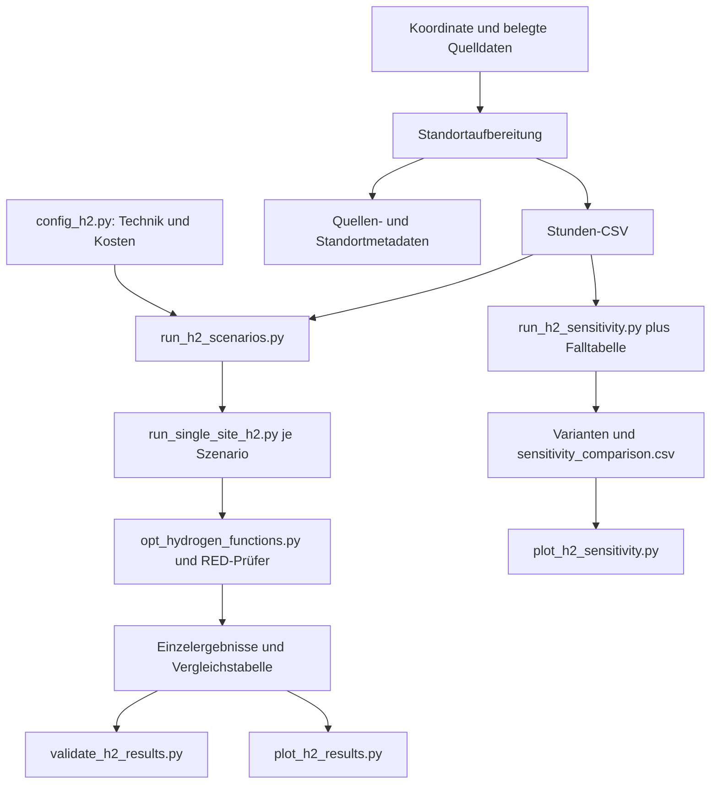

# Allgemeines H2-Modell und wissenschaftliche Methodik

**Stand: 4. Oktober 2026.** Dieses Dokument beschreibt den tatsächlich vorhandenen
standortunabhängigen Kern. Geplante Erweiterungen sind ausdrücklich gekennzeichnet.
Forschungsfrage und Reihenfolge stehen im [Masterplan](FORSCHUNGSARBEITSPLAN.md);
konkrete Daten und Ergebnisse stehen in den [Fallstudien](fallstudien/README.md).

## 1. Forschungsansatz und Herkunft

Ein lineares Optimierungsmodell bestimmt gleichzeitig Anlagenkapazitäten und
stündlichen Betrieb. Es minimiert die annualisierten Kosten zur Erfüllung einer
vorgegebenen H2-Abnahme. Unterschiedliche Stromkorrelationsregeln werden bei
gleichen Eingaben verglichen; Sensitivitäten verändern gezielt einzelne Einflüsse.

Der wissenschaftliche Ablauf umfasst Literatur-/Rechtsscreening, Definition von
Systemgrenze und quantifizierbaren Kriterien, Quellenprüfung, Datennormalisierung,
Optimierung, unabhängige Nachrechnung sowie Interpretation und Literaturvergleich.
Die Weiterentwicklung macht die Auslegungs- und Kostenwirkung der modellierten
Regeln sowie die Unterschiede physischer und regulatorischer Strombewertung prüfbar.

Aus dem Ammoniakmodell von Terlouw et al. wurde die Profilberechnung in
[calculate_renewable_yield.py](calculate_renewable_yield.py) übernommen und angepasst.
Lineare Bilanzen, Annuitäten und Gurobi-Struktur dienten als geprüfte Vorbilder.
H2-Konfiguration, Optimierungskern, RED-Prüfer, Runner und unabhängiger Validator
wurden für die neue Systemgrenze aufgebaut. Ammoniaksynthese, Stickstoffnachfrage,
NH3-Speicher/-Transport, globale Vorverarbeitung und alte LCA-Verarbeitung entfallen.

Der frühere `energy_data_processor.py` verlangte nicht versionierte
`ghg_factors*.json`. Der H2-Kern importiert ihn nicht. Faktoren werden stattdessen
belegt und ausdrücklich über die H2-Datenschnittstelle bereitgestellt.
Die [BSD-3-Clause-Lizenz](LICENSE) und Urheberhinweise bleiben erhalten.

## 2. Systemgrenze und funktionelle Einheit

**Funktionelle Einheit: 1 kg gasförmiger H2 am Ausgang des Druckspeichers bei 300 bar.**

Die Strombereitstellung erfolgt über PV, Onshore-Wind oder Netzbezug.
Der PEM-Elektrolyseur liefert H2 bei 30 bar; elektrische Verdichtung wird bis
350 bar abgebildet, der Tank besitzt 300 bar Nenndruck. Diese Druckannahmen gehören
zum gewählten Literaturpaket und werden auf Konsistenz geprüft. Dynamische
Druckgleichungen oder ein detaillierter Verdichtungsprozess werden nicht gelöst.

| Komponente | Abbildung im Kern |
|---|---|
| PV / Onshore-Wind | Kontinuierliche MW-Kapazität und stündliche Verfügbarkeitsprofile |
| Netz | Nichtnegativer physischer Import; stündlicher Preis und Emissionsfaktor |
| PEM | MW-Kapazität, konstanter spezifischer Strombedarf, variable Produktion |
| Kompressor | MW-Kapazität, proportionaler Strombedarf und H2-Verlust vor Speicherung |
| Druckspeicher | Nutzbare kg-Kapazität und zyklischer Stundenfüllstand |
| H2-Abnahme | Vorgegebene Lieferung je Stunde; vollständig zu erfüllen |
| Wasser | Bedarf proportional zur Produktion; Kosten, keine Wasserverfügbarkeitsrestriktion |

Transport und Nutzung hinter dem Speicherausgang, Ammoniak, Sauerstofferlöse,
Batterie, Anlagen-LCA, detaillierte Wasseraufbereitung, Genehmigungen und
Netzanschlussplanung liegen außerhalb des Kerns. Der wirtschaftliche Umfang
der Stromkosten wird in jeder Fallstudie ausdrücklich festgelegt.

## 3. Räumliche und zeitliche Struktur

Ein Lauf betrachtet einen Einzelstandort. Eine Koordinate beschreibt die Anlage;
Wetterzelle, Stromgebotszone, Emissionssystem und Finanzierungsregion dürfen davon
abweichende räumliche Ebenen haben. Jede Zuordnung wird getrennt dokumentiert.
Eine neue Koordinate allein liefert keine neue Nachfrage oder Finanzierung.

Der implementierte Optimierer verwendet **Stundenschritte**. Eingabezeitstempel
werden nach UTC normalisiert; zeitzonenlose Angaben behandelt der Validator als UTC.
Dies ersetzt keine korrekte Umrechnung lokaler Quelldaten einschließlich Sommerzeit.
Die Bedeutung einer Quellzeit, etwa Intervallbeginn oder Intervallende, muss vor
der Zusammenführung geklärt sein.

Das Modell kennt den gesamten Eingabeverlauf vor der Optimierung: perfekte Voraussicht.
Es ist keine Wetter-/Marktprognose und keine Optimierung einer Echtzeithandelsstrategie.
Historische Jahresdaten und ein typisches meteorologisches Jahr sind unterschiedliche
Datenarten; ihre konkrete Verwendung steht im Fallstudiendokument.

**Implementierter Kalenderstand:** `StudyConfig.temporal_correlation_timezone`
legt die Monatszeitzone ausdrücklich fest. Beide Solver und RED-Prüfer bilden
YYYY-MM-Gruppen aus dem UTC-Index nach Umrechnung in diese Zeitzone.
Der unabhängige Validator rechnet die Gruppen aus der gespeicherten Konfiguration
und dem Quellenvertrag nach. Default ist UTC für Legacy-Fälle; die EU-Auswahl
setzt die jeweilige Ortszeitzone. S2 nutzt weiterhin eindeutige physische UTC-
Stunden, auch bei doppelt vorkommenden lokalen Herbstuhrzeiten. Das gewählte
Untersuchungsjahr ist keine universelle Modellregel.

**Implementierte Kalenderannualisierung:** `StudyConfig.annual_hours` und
`annualization_basis` bestimmen die Jahresreferenz ausdrücklich.
`historical_calendar_year` prüft das tatsächliche `profile_calendar_year`
(8.784 Stunden im Schaltjahr, sonst 8.760). Für einen vollständigen historischen
Kalender ist der Faktor 1. `legacy_365_day_reference` behält die bisherige
8.760-Stunden-Referenz für bestehende Fälle. Die unabhängige Ergebnisprüfung
rekonstruiert diese Referenz aus Konfiguration und Kalender und weist
widersprüchliche gespeicherte Faktoren zurück. Eine Zeilenzahl allein genügt
nicht als Jahresnachweis; Quellenvertrag und lokale Zeitachse werden ebenfalls geprüft.

## 4. Datenschnittstelle und Eingabeprüfung

[h2_input_data.py](h2_input_data.py) stellt `validate_hourly_input()` bereit.
Der numerische Kern erhält eine Tabelle mit folgenden Pflichtspalten:

| Spalte | Einheit | Bedeutung / Prüfung |
|---|---|---|
| `timestamp` | UTC-Zeitstempel | Eindeutig, sortiert, lückenlos stündlich |
| `pv_capacity_factor` | 0–1 | Verfügbarer Anteil der PV-Nennleistung |
| `wind_capacity_factor` | 0–1 | Verfügbarer Anteil der Wind-Nennleistung |
| `electricity_price` | EUR/MWh | Endlicher Stundenpreis; negative Werte erlaubt |
| `grid_emission_factor` | kg CO2e/MWh | Endlicher nichtnegativer Netzfaktor |
| `h2_demand` | kg/h | Nichtnegative Stundenabnahme, positive Gesamtsumme |

Fehlende Spalten, NaN/Unendlich, Lücken, Duplikate und ungültige Werte werden
abgewiesen. `expected_hours` kann zusätzlich die Zeilenzahl prüfen; nicht jeder
Aufruf setzt diese Option. Vollständigkeit eines Fallstudienjahrs muss daher
zusätzlich nachgewiesen werden. Zusätzliche Spalten bleiben erhalten, werden
dadurch aber nicht automatisch validiert oder vom Optimierer verwendet.

Technik-, Kosten-, Lebensdauer- und WACC-Parameter kommen aus
[config_h2.py](config_h2.py) beziehungsweise einer ausdrücklich übergebenen
`ModelConfig`. Jeder skalare Kernparameter besitzt Wert, Einheit, Quelle und
gegebenenfalls Bezugsjahr. Die Konfiguration führt keine Excel-/LCA-Importe aus.

**Implementierte Faktortrennung:** `grid_emission_factor` bleibt der betriebliche
Pflichtfaktor im Modus `complete`. Die zusätzliche Spalte `regulatory_grid_emission_factor` aktiviert
`explicit_separate_factors` und muss endlich und nichtnegativ sein. Beide
Quellen werden mit Bezugsjahr, Raumebene, Einheit und Emissionsgrenze verlangt.
CSV-Eingaben verwenden einen an ihren SHA-256 gebundenen Quellenvertrag;
`--emission-factor-metadata` lädt ihn. `--require-separate-emission-factors`
verhindert den Legacy-Rückfall vor dem Solverstart. Ohne Zusatzspalte gilt
ausdrücklich `legacy_shared_factor`, damit historische Eingaben reproduzierbar bleiben.
Der ausdrücklich gewählte Modus `regulatory_only` verlangt stattdessen nur
`regulatory_grid_emission_factor` mit eigenem Quellenvertrag. Die betriebliche
Spalte muss fehlen; Kennzahlen sind `null`, Status `not_evaluated`. Standardmäßig
bleibt `complete` aktiv und verlangt den betrieblichen Faktor. Ein fehlender
Faktor wird niemals als Null ergänzt. Kosten und regulatorische Teilprüfungen
werden unabhängig nachgerechnet; operative Prüfungen sind hier nicht ausgewertet.

## 5. Mathematische Formulierung

### Indizes, Parameter und Einheiten

\(t\in T\) bezeichnet Stunden, \(m\in M\) Monate und \(T_m\) deren Stunden.
\(\Delta t=1\,h\). Leistung wird in MW, Energie je Intervall in MWh,
H2-Mengen und Speicherzustände in kg gerechnet.
Bei einer Stunde ist der numerische Wert der kg/h-Abnahme zugleich die kg-Menge
des Intervalls; im Folgenden bezeichnet \(D_t\) diese geforderte Liefermenge.

Parameter: Kapazitätsfaktoren \(CF_{j,t}\), Netzpreis \(p_t\), Netzfaktor \(EF_t\),
spezifischer PEM-Strombedarf \(e_{el}\) und Verdichtungsbedarf \(e_c\) in MWh/kg,
Kompressorverlust \(\lambda\), CAPEX, fixe/variable OPEX, Lebensdauer \(n_i\)
und realer Kalkulationszins \(r_i\).

### Entscheidungsvariablen

| Variable | Einheit | Bedeutung |
|---|---|---|
| \(K_{PV},K_W,K_{el},K_c\) | MW | Installierte Leistung |
| \(K_s\) | kg H2 | Nutzbare Speicherkapazität |
| \(G_{j,t}\), \(U_{j,t}\) | MWh | Modellierte EE-Erzeugung bzw. unmittelbar genutzter Anteil |
| \(E_{g,t}\) | MWh | Physischer Netzimport |
| \(E_{el,t},E_{c,t}\) | MWh | Elektrolyse- bzw. Verdichtungsstrom |
| \(H_t\) | kg H2 | Produktion vor Kompressorverlust |
| \(S_t\) | kg H2 | Speicherfüllstand am Intervallende |

Alle Variablen sind kontinuierlich und nichtnegativ. Es gibt keine ganzzahlige
Modulanzahl oder binäre Ein-/Ausschaltentscheidung.

### Erzeugung, Direktnutzung und Strombilanz

Für \(j\in\{PV,W\}\):

\[
0\leq G_{j,t}\leq K_j CF_{j,t}\Delta t,\qquad 0\leq U_{j,t}\leq G_{j,t}.
\]

In **S0 und S3** gilt zusätzlich \(U_{j,t}=G_{j,t}\).
Nur S1/S2 erlauben eine zugeordnete Erzeugungsmenge oberhalb der Direktnutzung.

\[
U_{PV,t}+U_{W,t}+E_{g,t}=E_{el,t}+E_{c,t}.
\]

Abregelung ist verfügbare Energie \(K_j CF_{j,t}\Delta t\) minus modellierte
Erzeugung \(G_{j,t}\). Der zugeordnete Überschuss ist hingegen
\(\sum_j(G_{j,t}-U_{j,t})\). Diese Größen dürfen nicht gleichgesetzt werden.
Überschuss besitzt derzeit keine Exportvergütung, Exportkapazitätsgrenze oder
zusätzliche PPA-/Netzkosten. Er ist eine vereinfachte Mengenallokation.

### Elektrolyse und Verdichtung

\[
H_t=E_{el,t}/e_{el},\qquad 0\leq E_{el,t}\leq K_{el}\Delta t.
\]

\[
E_{c,t}=H_t e_c,\qquad 0\leq E_{c,t}\leq K_c\Delta t.
\]

Der spezifische PEM-Verbrauch ist konstant. Mindestlast, Anfahrkosten,
Lastgradienten und Teillastwirkungsgrad sind nicht implementiert.
Der effektive Verdichtungsbedarf wird aus dem isentropen Bedarf und den
isentropen/mechanischen Wirkungsgraden der Konfiguration berechnet.

### H2-Bilanz, Speicher und Lieferung

\[
S_t=S_{t-1}+(1-\lambda)H_t-D_t,\qquad 0\leq S_t\leq K_s.
\]

\[
S_{\text{vor erster Stunde}}=S_{\text{nach letzter Stunde}}.
\]

Der zyklische Anfangsfüllstand wird mitoptimiert und muss am Ende wiederhergestellt
werden. Dadurch lässt sich keine kostenlose Anfangsfüllung verbrauchen.
Jede Stundenlieferung ist verbindlich; Lastabwurf oder zusätzliche H2-Verkäufe fehlen.
Die Tankentnahme besitzt keine separate Leistungsgrenze.
\(\lambda\) bezeichnet den Verlust bei der Verdichtung **vor Speichereintritt**.
Es gibt keine zeitabhängige Tankselbstentladung.

## 6. Kosten, Annualisierung und LCOH

Der Kapitalwiedergewinnungsfaktor lautet:

\[
CRF(r_i,n_i)=\frac{r_i(1+r_i)^{n_i}}{(1+r_i)^{n_i}-1},
\qquad CRF(0,n_i)=1/n_i.
\]

Einheiten werden vor Anwendung der Kostenkoeffizienten angeglichen: beispielsweise
MW × 1.000 für CAPEX in EUR/kW. Speicher-CAPEX beziehen sich auf kg Kapazität.
WACC wird als Dezimalzahl eingesetzt; reale und nominale Größen dürfen nicht
unbegründet vermischt werden. Quelle, Preisjahr und Zinsdefinition gehören zum Fall.

Für \(N\) modellierte Stunden:

\[
a=\frac{H_{Jahr}}{N\Delta t},\qquad H_{Jahr}=\text{explizit geprüfte Jahresstunden}.
\]

Die Zielfunktion ist:

\[
\min C_a=
\sum_i K_i\bigl(CAPEX_i\,CRF_i+FOM_i\bigr)
+a\left[\sum_{t,j}G_{j,t}\,VOM_j+
\sum_t E_{g,t}p_t+\sum_t H_t\,w\,p_w\right].
\]

Die Darstellung setzt bereits angeglichene Einheiten voraus. \(w\) ist der
Wasserbedarf in m³/kg H2 und \(p_w\) der Wasserpreis in EUR/m³.
Wasser- und Verdichtungsbedarf beziehen sich auf Produktion vor H2-Verlust.
Variable EE-OPEX fallen auf modellierte Erzeugung an, auch auf zugeordneten Überschuss.

CAPEX-Annuitäten und fixe OPEX sind bereits Jahreskosten und werden nicht nochmals
mit \(a\) multipliziert. Zeitabhängige Betriebskosten, Mengen und Emissionen werden
annualisiert. Für ein vollständiges historisches Kalenderjahr ist \(a=1\),
auch im Schaltjahr; die Legacy-Referenz bleibt ausdrücklich 8.760 Stunden.
Ein kurzer zyklisch wiederholter Testzeitraum ist kein repräsentativer Jahresfall.

\[
Q_a=a\sum_t D_t,\qquad LCOH=C_a/Q_a.
\]

LCOH wird in EUR/kg **geliefertem** H2 ausgewiesen. Es gibt keine eigene
Stackersatz-/Ersatzinvestitionsrechnung, Steuercashflows oder Restwertrechnung.
Der reale WACC ist der effektive Annuitätszins des vereinfachten Kostenmodells.

## 7. RED-III-Abbildung

### Rechtsbezug und untersuchter Pfad

Grundlage sind [RED III / Richtlinie 2023/2413](https://eur-lex.europa.eu/eli/dir/2023/2413/oj),
[Verordnung 2023/1184](https://eur-lex.europa.eu/eli/reg_del/2023/1184/2024-06-10)
für die Stromkriterien und [Verordnung 2023/1185](https://eur-lex.europa.eu/eli/reg_del/2023/1185/oj)
für die THG-Methode. Der Kern untersucht einen vereinfachten allgemeinen
Strombezugsweg nach Artikel 4 Absatz 4, keine vollständige Auswahl aller Rechtswege.

Der im Code gespeicherte Rechtssnapshot ist 10.09.2026; die frühere Dokumentation
vermerkt eine Rechtsprüfung am 13.09.2026. Diese Reorganisation ist keine neue
Rechtsprüfung. Vor Abgabe bzw. Zertifizierungsanwendung sind aktuelle Fassungen,
nationale Anwendung und Projektbedingungen erneut zu prüfen.

### S0, S1, S2 und optionale S3

| Szenario / Codewert | Modellregel | Zweck |
|---|---|---|
| S0 / `reference` | Keine RED-Zeitkorrelation; EE-Erzeugung = Direktnutzung | Wirtschaftliche Referenz, kein RFNBO-Nachweis |
| S1 / `red_monthly` | Vollständige EE-Mengendeckung je Monat | Wirkung monatlicher Korrelation |
| S2 / `red_hourly` | Vollständige EE-Mengendeckung je Stunde | Wirkung stündlicher Korrelation |
| S3 / `off_grid` | Netzimport = 0; EE-Erzeugung = Direktnutzung | Implementierte optionale Inselvariante |

S3 wird im Szenarienrunner nur mit `--include-off-grid` ergänzt; es ist kein
automatischer vierter Kernfall. Das zeitliche RED-Prüfflag bleibt dort `None`.
Null Netzemissionen allein sind kein Zertifizierungsnachweis.

Für S1:

\[
\sum_{t\in T_m}(G_{PV,t}+G_{W,t})\geq
\sum_{t\in T_m}(E_{el,t}+E_{c,t})\quad\forall m.
\]

Für S2:

\[
G_{PV,t}+G_{W,t}\geq E_{el,t}+E_{c,t}\quad\forall t.
\]

Verdichtungsstrom wird aufgrund der funktionellen Einheit mit zugeordnet.
S1 erlaubt zeitversetzte Erzeugung innerhalb eines Monats; S2 erlaubt keine
Anrechnung aus anderen Stunden. In beiden Fällen ist physischer Netzbezug technisch
möglich, sofern die regulatorische Mengenbilanz ausreichend erneuerbare Erzeugung enthält.
Die Mengenallokation ist keine physische Stromspeicherung.

Im hinterlegten Rechtsstand: grundsätzlich monatlich bis Ende 2029, stündlich ab
2030, mögliche frühere nationale Anwendung ab Juli 2027. Beide Regeln werden als
Vergleichsszenarien auf dieselben Daten angewandt. Daraus folgt keine Prognose oder
automatische Aussage zur Rechtsgültigkeit eines konkreten Inbetriebnahmejahrs.

### Externe Nachweise und Ausnahmen

Zusätzlichkeit, Förderstatus, Inbetriebnahme, geografische Korrelation,
Strombezugsvertrag/eigene Erzeugung, eindeutige Allokation und Ausschluss von
Doppelzählung benötigen externe Projekt-/Vertragsnachweise.
Sie werden nicht aus Koordinate, Wetter oder Gebotszonenpreis abgeleitet.
Der Prüfbaustein dokumentiert die 36-Monats-Altersregel und den Übergang der
Zusätzlichkeit bis 2038 für vor 2028 in Betrieb genommene Anlagen als Rechtsparameter.
Das LP optimiert diese Fristen nicht.

Im internen Kontrollaufruf werden Zusätzlichkeit, geografische Korrelation und
exklusive Allokation auf `True` gesetzt, um Zeit- und THG-Teilprüfung zu isolieren.
Dies sind **Szenarioannahmen**, keine bestätigten Nachweise.

Die Niedrigpreis-Ausnahme ist im Optimierer deaktiviert. Der unabhängige Prüfer
besitzt dafür eine Option mit tatsächlichen Day-Ahead-/gegebenenfalls ETS-Daten:
höchstens 20 EUR/MWh oder unter 0,36 × ETS-Preis nach dem hinterlegten Rechtsstand.
Dynamische Preise allein aktivieren diese Option nicht.
Die Sonderwege >90 % erneuerbare Gebotszonenerzeugung, <18 g CO2e/MJ Netzintensität
oder vermiedener Redispatch werden im Kern nicht optimiert.

## 8. Betriebliche und regulatorische Emissionen

### Betriebliche Rechnung

\[
GHG_{op,a}=a\sum_t E_{g,t}EF_{op,t},\qquad I_{op}=GHG_{op,a}/Q_a.
\]

Diese Kennzahl bewertet den physischen Netzimport mit dem dokumentierten Faktor.
Seine Bilanzgrenze und räumliche Ebene gehören in jede Fallstudie.
Sie ist weder automatisch ein marginaler Faktor noch eine vollständige Produkt-LCA.
Der Kern erhebt keinen CO2-Preis und keine betriebliche CO2-Obergrenze;
der Faktor beeinflusst daher die Berichterstattung, nicht das Kostenminimum.

### Statische Länderreferenz in der aktuellen EU-Basis

Ein Stundenformat verlangt keinen variablen Faktor: Für Hamburg/Huelva gilt
\(EF_{op,t}=EF_{Land,2024}\) für alle Stunden des historischen Modelljahres 2024.
Damit folgt \(GHG_{op,a}=EF_{Land,2024}\,E_{Netz,a}\). Stündlicher Netzbezug
bestimmt weiter die jeweiligen Emissionsmengen; eine emissionsärmere Bezugsstunde
kann dieser statische Ansatz jedoch nicht erkennen.

`prepare_eu_static_inputs.py` übernimmt die veröffentlichte EEA-Inventarkonvention
und rechnet den Bruttofaktor mit nationalem Eurostat-GEP/NEP näherungsweise auf
Nettoerzeugung um. Quellen, Bezugs-/Anwendungsjahr und Übertragungsunsicherheiten
stehen in `input_data/h2_eu_static_factors.json` und den CSV-Quellenverträgen.
Dies ist eine nationale Erzeugungsreferenz zur Bewertung des modellierten Imports,
keine Verbrauchsflusszuordnung, marginale Intensität oder vollständige LCA.
Die eigene Brutto/Netto-Umrechnung ist kein neu veröffentlichtes EEA-Inventar.
EEA-Nullansätze für Erneuerbare einschließlich Biomasse sind eine übernommene
Inventarkonvention. Separate JRC-CH4/N2O-Werte werden nicht in diese Quelle hineingemischt.
Keine numerischen Konfidenzgrenzen werden ohne Datengrundlage erfunden.

### Regulatorische Teilrechnung

Für S1/S2 ist die ungedeckte Menge je Korrelationsperiode \(b\):

\[
L_b=\max\{0,\sum_{t\in b}(E_{el,t}+E_{c,t})-
\sum_{t\in b}(G_{PV,t}+G_{W,t})\}.
\]

Im Code wird eine verbleibende Lücke proportional zum physischen Netzimport
der Periode auf Stunden verteilt. Eine Lücke ohne zuordenbaren Import löst einen
Fehler aus. S0 bewertet diagnostisch den gesamten Netzimport; S3 besitzt keine Lücke.
Vollständig qualifiziert zugeordneter EE-Strom erhält in diesem Modellpfad Faktor null.

\[
GHG_{reg,a}=a\sum_t E_{reg,nonEE,t}EF_{reg,t},\qquad I_{reg}=GHG_{reg,a}/Q_a.
\]

Die Symbole \(EF_{op}\) und \(EF_{reg}\) trennen die Konzepte. Beide Solverpfade
lesen nun separate Faktoren, sofern der dokumentierte getrennte Eingabevertrag
vorliegt. Die Zielfunktion und Dispatch-Nebenbedingungen wurden dabei nicht
verändert. Der unabhängige Ergebnisvalidator prüft beide Exportspalten
gegen ihre jeweiligen Eingabequellen. Legacy-Eingaben verwenden weiter einen
gemeinsamen Faktor und nennen diesen Modus ausdrücklich.
In S1/S2 ist die Lücke wegen der erzwungenen vollständigen Mengendeckung ohnehin
numerisch null. Das bedeutet nicht, dass physischer Netzstrom emissionsfrei wird.

### Quellenbasierte Faktorenprüfung vor Freigabe

`eu_emission_factor_audit.py` stellt keine fertigen Solverinputs her. Es decodiert
JSON-stat anhand der tatsächlichen Dimensionen, prüft Rohquellenhashes und
unterscheidet fehlende Zellen, veröffentlichte Nullen und Beobachtungsflags.
Überlappende Brennstoffaggregate werden separat ausgewiesen statt addiert.
Direkte Brennstofffaktoren verwenden die NCV-Basis; Lebenszyklusspalten werden
nicht als direkte Emissionen übernommen. Gedruckte gerundete Tabellenwerte
behalten ihr Präzisionslimit.

Für vollständige kompatible KWK-Daten ist die Effizienzmethode vorgesehen:
`A_el=(P/eta_el)/((P/eta_el)+(H/eta_h))`,
`f_el=f_fuel*B*A_el/P_net`. Bei Eigenerzeugern (APCHP) enthält der Eurostat-Input
Strom und verkaufte Wärme; Brennstoff für selbst verbrauchte Wärme ist bereits
dem Endverbrauch zugeordnet. Eine erneute Allokation auf die unbekannte
selbst genutzte Wärme wäre daher nicht zulässig. Die implementierte Rechnung
des gemeldeten Teilprozesses ist ausdrücklich eine bedingte Bilanznäherung.

Referenzszenarien unterscheiden Baujahr-/Wärmeformkonventionen und Brutto-/
Netto-Bezugsgrößen. Die Referenzbandbreite ist weder ein Konfidenzintervall
noch die vollständige Unsicherheit eines übertragenen Jahres oder Stromsystems.
Ein veröffentlichter Nullwert beweist nach Eurostat nicht zwingend physische
Abwesenheit; diese Einschränkung bleibt in den Rechennachweisen sichtbar.
Eine positive unbekannte Kategorie blockiert weiterhin die eigene dynamische
Technologie-Punktfaktorfreigabe. Dieses Audit bleibt eine optionale Untersuchung;
die vom Nutzer anschließend gewählte statische EEA-Jahresreferenz rekonstruiert
diese Kategorien nicht selbst und ist als getrennte Methode freigegeben.

Der Szenarienrunner reicht den getrennten Faktorvertrag unverändert an alle
Einzelläufe weiter. Der Sensitivitätsrunner erzeugt für jede abgeleitete CSV einen
eigenen SHA-256-gebundenen Vertrag mit Originalrückverweis und einer dokumentierten
Einzelfaktortransformation. Diese Quellen- und Konfigurationsbindung wird vor
der Optimierung geprüft. Ein stiller Legacy-Fallback ist ausgeschlossen.

### THG-Grenzwert und Bedeutung der Flags

Im hinterlegten Teiltest gilt:

\[
94(1-0{,}70)=28{,}2\;g\,CO2e/MJ;
\qquad 28{,}2\cdot120/1000=3{,}384\;kg\,CO2e/kg\,H2.
\]

Verwendet werden 70 % Minderung, fossiler Vergleichswert 94 g/MJ und unterer
H2-Heizwert 120 MJ/kg. Dieser Grenzwert betrifft rechtlich die Produktbilanz;
der vorhandene Kern berechnet davon eine vereinfachte elektrische Teilkomponente.
Weitere erforderliche Produktbeiträge werden dadurch nicht nachgewiesen.

Der THG-Test erfolgt **nach** dem Solverlauf. S1/S2 brechen bei Verletzung ab;
S0 erhält eine diagnostische Bewertung. Der Test ist keine zusätzliche LP-
Nebenbedingung und unter vollständiger EE-Zuordnung keine bindende Auslegungsrestriktion.

`red_iii_temporal_compliant` und `red_iii_ghg_compliant` bedeuten jeweils nur,
dass die implementierte Teilprüfung bestanden wurde. Sie belegen weder externe
Projektkriterien noch vollständige RFNBO-Zertifizierung.

## 9. Skript- und Dateifluss einfach erklärt

Eine CSV ist eine Tabelle, JSON enthält strukturierte Parameter/Quellinformationen,
PNG ist eine Abbildung. Ein Hash ist der Fingerabdruck einer Datei.
CAPEX bezeichnet Investitionen, OPEX laufende Kosten, WACC den Kalkulationszins,
LCOH die Kosten je geliefertem Kilogramm. Ein Solver sucht die günstigste zulässige Lösung.

### Aufbereitung und Quellen

Der bestehende [Aufbereiter](prepare_single_site_h2_input.py) kann PVGIS-TMY oder
lokales Wetter verwenden und die [Profilfunktionen](calculate_renewable_yield.py)
aufrufen. Er ordnet Länder über Natural Earth oder einen expliziten ISO-Code zu.
Optional kann er auf einen vorgegebenen Rastermittelpunkt abbilden.
Preise/Faktoren kommen aus versionierten Länderdateien, ausdrücklich vorgegebenen
Konstanten oder Stundenreihen. Die bisherige Nachfrageoption setzt konstante Tagesabnahme.

Ausgabe: die Standort-Stunden-CSV und `<dateistamm>_metadata.json` mit Quellen,
Koordinaten, Einheiten und Zeitzuordnung. Der Solver liest die Stunden-CSV;
die Aufbereitungsmetadaten sind kein automatisch eingelesener numerischer Zusatzinput.
Ihre vollständige Weitergabe durch alle Runner ist noch zu erweitern.

`gpp_2025_country_pages_numeric.json`, `h2_country_factors.json` und Natural-Earth-
Ländergrenzen dienen dem bisherigen Aufbereiter. `technology_costs.xlsx` und die
Steffen-WACC-Datenbank sind Quellen-/Vergleichsbestände; sie werden im normalen
bisherigen Lauf nicht automatisch als aktuelle Modellparameter geöffnet.
Die EU-Entwurfs-JSON wird vom heutigen Modell ebenfalls nicht automatisch eingelesen.

Der bisherige TMY-Aufbereiter kann gleich lange Quellen positionsweise auf sein
technisches Indexjahr abbilden. Diese Funktion ist **kein geprüfter Adapter für
gleichzeitige historische Reihen**. Der zusätzliche historische Pfad
[eu_historical_data.py](eu_historical_data.py) verlangt stattdessen einen expliziten
UTC-Index aus lokalen Jahresgrenzen und vollständige native Quellintervalle.
Er verwirft falsche Jahre, Lücken, Dubletten, ungeordnete Zeiten und ungültige Einheiten;
Preise werden dauergewichtet gemittelt, belegte Intervallleistung zu Energie integriert.
Momentanmessungen bleiben als Energieapproximation gekennzeichnet.

[prepare_eu_historical_data.py](prepare_eu_historical_data.py) berechnet aus diesem
Zeitvertrag Profile und Preise sowie getrennte Erzeugungsdiagnostik. Rohantworten
werden vor Verwendung gegen Abrufnachweise und SHA-256 geprüft. Fehlende Faktoren
für positive Kategorien oder ein Erzeugungsnenner null verhindern die Faktorfreigabe.
Dieser Quellenpfad bleibt getrennt von der Freigabe.
`prepare_eu_regulatory_inputs.py` erhält die frühere separate Kosten-/
Regulatorik-Freigabe ohne betriebliche Bewertung. Die aktuelle Basis wird mit
`prepare_eu_static_inputs.py` und dem belegten jährlichen Länderfaktorkatalog
als vollständige getrennte D0/D1/D2-Faktoreingabe erzeugt;
Ortsmonate sind über den expliziten Konfigurationskalender umgesetzt. Getrennte regulatorische
Faktoren wurden als technische Voraussetzung bereits während Schritt 19 implementiert.
Quelladapter ersetzen keine fachliche Kategorien-/Bilanz- und Datenfreigabe.

`eu_site_configuration.py` lädt die gewählte EU-Standortkonfiguration ausdrücklich
über `--eu-site`. Fünf reale WACC-Komponenten, Quellenjahr 2021 und Designhash
werden gespeichert. Reale Nachsteuerbenchmarks sind effektive Annuitätenzinsen;
kein zweiter Inflationsabzug oder zusätzlicher Steuerschutz. Historisches
Wetter-/Kalenderjahr 2024 wird getrennt vom Finanzierungsjahr dokumentiert.
Das ältere Finanzierungsjahr ist ein ausdrücklicher zeitlicher Proxy. Die reale
Geldbasis bezeichnet die Kostenmaßeinheit; sie ist kein Wetter-/Marktbeobachtungsjahr.

`eu_demand_profiles.py` bildet vorgegebene D0/D1/D2-Fenster im tatsächlichen
Ortskalender ab und normiert jedes Profil auf dieselbe Jahresmenge. Nullstunden
sind erlaubt; positive Pflichtlieferungen bleiben fest. Das Schaltjahr verändert
bei unveränderter Jahresmenge die stündliche Normierung. Die Lieferprofile sind
synthetische Versuchsparameter, keine Nachfragebeobachtungen.

### Optimierung und Exporte

| Einstieg | Input | Verarbeitung | Output / nächste Verwendung |
|---|---|---|---|
| `run_single_site_h2.py` | Stunden-CSV, Szenario, Konfiguration, Solver | Validieren, optimieren, nachprüfen | Vier Einzelergebnisdateien für Validator/Plots |
| `run_h2_scenarios.py` | Eine gemeinsame Stunden-CSV und Parameter | S0/S1/S2 nacheinander; S3 optional | Szenarienordner, Vergleichs-CSV und Metadaten |
| `validate_h2_results.py` | Gespeicherte Ergebnis-CSV/JSON | Unabhängig nachrechnen | Prüftabelle, Stichproben, JSON-Bericht |
| `plot_h2_results.py` | Vergleichs- und Stunden-CSV | Konsistenz prüfen, visualisieren | Sechs PNGs und Quellenmanifest |
| `run_h2_sensitivity.py` | Stunden-CSV, Faktorvertrag, Falltabelle, Basisparameter, optional akzeptierte Basisläufe | Einzelfaktortransformation nach Standortwahl; neue Varianten lösen und akzeptierte Basis referenzieren | Einzelläufe, CSV-/Sidecar-/Basiskonfigurationsverträge, Sensitivitätsvergleich, Metadaten |
| `plot_h2_sensitivity.py` | Sensitivitätsvergleich | Vergleich zum jeweiligen Szenariobasisfall | Sensitivitätsgrafiken und Manifest |

Jeder Einzelrunner schreibt `validated_input.csv`, `summary.csv`,
`hourly_operation.csv` und `run_metadata.json`. Der Szenarienrunner ergänzt
`scenario_comparison.csv` und `scenario_comparison_metadata.json`.
Ergebnisordner heißen `S0_reference`, `S1_red_monthly`, `S2_red_hourly`, optional `S3_off_grid`.

`summary.csv` enthält Jahreskennzahlen und Kosten; `hourly_operation.csv` erklärt
den Betrieb. Metadaten enthalten Parameter mit Einheiten/Quellen und Eingabehashes.
Identische Eingabehashes belegen identische Dateibytes; korrekte Parametervergleiche
erfordern zusätzlich Prüfung der Konfiguration. Ein Hash belegt keine wissenschaftliche
Qualität oder inhaltliche Gleichwertigkeit unterschiedlich formatierter Tabellen.

Die sechs Hauptplots zeigen LCOH, Kapazitäten, Kostenkomponenten, Betriebsindikatoren,
Emissionen/RED-Teilprüfung und einen wählbaren Stundenausschnitt. Das Manifest
dokumentiert Quellenhashes, Zeitraum und Ausgabepfade. Plotten optimiert nicht erneut.
Konkrete Dateinamen/Ordner und Befehle stehen in der jeweiligen Fallstudie.

## 10. Solver, Umgebung und praktische Fehlerhilfe

Gurobi und SciPy/HiGHS lösen dasselbe kontinuierliche LP. Kleine Fälle erlauben
einen Vergleich von Zielfunktion, Bilanzen und Kapazitäten. Bei gleichwertigen
Optima können Betriebspläne abweichen; entscheidend sind Kosten und Zulässigkeit.

Die lokale Gurobi-Lizenz hat große Jahresmodelle abgewiesen. Jahresläufe wurden
mit `--solver scipy-highs` gelöst. `auto` wechselt nur bei der spezifischen
größenbeschränkten Gurobi-Lizenzmeldung; es ist kein allgemeiner Fallback für
fehlende Pakete, ungültige Lizenzen oder beliebige Optimierungsfehler.

Die Conda-Umgebung ist in [environment_h2.yml](environment_h2.yml) beschrieben.
Bei vorhandenem Environment: `conda activate h2-model`, dann aus dem Projektordner
starten. Bei Spyder denselben Interpreter einstellen, lokal
`C:\Users\meric\anaconda3\envs\h2-model\python.exe`; für die verwendete Spyder-Version
ist `spyder-kernels` 3.0 erforderlich. Der Pfad wird in den Interpreter-Einstellungen
eingetragen, nicht als Befehl am Python-Prompt `>>>`.

In Windows-CMD gehören Befehle vollständig in eine Zeile; PowerShell-Backticks
sind dort keine Zeilenfortsetzung. `python <skript> --help` zeigt benötigte Argumente.
Vorhandene Ausgaben sind ohne `--overwrite` geschützt; bewusstes Ersetzen verlangt diese Option.

| Beobachtung | Bedeutung / nächster Check |
|---|---|
| `SystemExit: 2` / erforderliche Argumente fehlen | CLI-Aufruf prüfen; Spyder startet sonst ohne die benötigten Argumente |
| Skript nicht gefunden | Im Projektordner starten oder vollständigen Skriptpfad angeben |
| Eingabe nicht gefunden | Tatsächlichen Namen/Pfad der erzeugten CSV prüfen; ein Ergebnisordner ersetzt sie nicht |
| Paket fehlt | Aktiven Interpreter/Conda-Umgebung prüfen und deren Abhängigkeiten installieren |
| Länderfaktor fehlt | Belegten Wert bzw. Reihe übergeben; keine unbegründete Null einsetzen |
| Windkapazität null | Kann Kostenoptimum sein; Profil, Kosten und Sensitivität prüfen |
| Plot/Validierung funktionieren nach fehlgeschlagenem Lauf | Möglicherweise alte Ergebnisse gelesen; Erfolgsmeldung, Hashes und Laufmetadaten prüfen |

## 11. Sensitivität und Validierung

Der Sensitivitätsrunner prüft die vollständige Falltabelle und alle Interventionen
vor der ersten Optimierung. Pro Variante wird ein Einfluss geändert und gegen den
passenden Standort-/Szenariobasisfall verglichen. Konfigurationen werden kopiert;
abgeleitete Stundenreihen erhalten eigene CSVs. Die Originaleingabe bleibt erhalten.
Nachfrageprofile werden im vorgegebenen Ortskalender erzeugt und auf dieselbe
Jahreslieferung normiert; sie sind exogene Vergleichsannahmen.

Der additive Preisoffset lautet `p_t' = p_t + Δp` für jede historische Stunde.
Alle Zeitstempel und Preisabstände bleiben erhalten. Negative Preise werden weder
gekappt noch durch ein konstantes Preisniveau ersetzt. Ein additiver Offset darf
das Vorzeichen einzelner Stunden ändern; es gibt keine Nullkappung. Die bisherige absolute
Konstantpreisvariante bleibt als gesonderte Legacy-Option verfügbar.

Eine reale WACC-Verschiebung addiert denselben Betrag zu allen fünf Komponentenraten:
PV, Onshore-Wind, PEM, Kompressor und H2-Speicher. Sie wird **nach der expliziten
EU-Standortwahl** angewandt, damit der Standortlader die Intervention nicht zurücksetzt.
Technologieabstände und der dokumentierte historische Basisbenchmark bleiben
erkennbar. Die effektiven Sensitivitätsraten werden getrennt vom genehmigten
Basis-WACC gespeichert; sie sind Szenarioannahmen, keine neuen Finanzierungsbelege.
Alle resultierenden Raten müssen im zulässigen Konfigurationsbereich liegen.
Die frühere einheitliche absolute WACC-Option bleibt ausdrücklich unterscheidbar.

PEM-CAPEX- und PEM-Strombedarfsfaktoren multiplizieren jeweils nur den entsprechenden
Basisskalar. Fixe jährliche PEM-OPEX bleiben beim CAPEX-Faktor unverändert;
Kompressorwirkungsgrade, Verdichtungsparameter und H2-Verlustparameter bleiben
beim PEM-Strombedarfsfaktor unverändert. Der implizierte PEM-LHV-Wirkungsgrad
`implied_lhv_efficiency_fraction = H2_LHV_KWH_PER_KG / e_PEM` folgt dem geänderten
spezifischen Strombedarf; dies ist keine zweite unabhängig gesetzte Intervention.
Multiplikatoren müssen positiv und endlich sein. Die konkreten Bänder stehen
in der jeweiligen Fallstudie.

Jede abgeleitete CSV besitzt einen eigenen Schema-1.0-Sidecar mit ihrem SHA-256,
Pfad und SHA-256 von Original-CSV und Original-Sidecar, `case_transformation` sowie
einer SHA-gebundenen `baseline_configuration`. Vor dem Solve werden Parent-Bytes,
Basiskonfiguration, Quellen, Kalender-/Nachfragekontext und die deklarierte
Einzelfaktoränderung geprüft. Nur die deklarierte Preisintervention darf eine
Stundenwertespalte verändern; zusätzliche Textmetadaten bleiben erhalten.
Die ursprünglichen Quellenhashes werden während des gesamten Aufrufs festgehalten.

Akzeptierte Basisläufe können über `reuse_baseline_directory` beziehungsweise
`--reuse-baseline-dir` aus vorhandenen Exporten referenziert werden. Dafür werden
Originalquellen, Konfiguration, Szenarien, optimale Ergebnisstatus und die
unveränderte Abnahme geprüft; der unabhängige Validator prüft die gespeicherten
Ergebnisse erneut in einem separaten Ausgabeordner. Dieser Weg führt **keinen
neuen Basissolve** aus und schreibt nicht in das Basisarchiv. Vergleichszeilen und
Metadaten unterscheiden neue Optimierungen von wiederverwendeten Ergebnissen.

Qualitätssicherung erfolgt auf drei Ebenen:

1. Automatisierte Tests für Komponenten, Datenfehler, kleine Bilanzfälle,
   Korrelationsgrenzen, Solververgleich, Export, OAT-Provenienz und Integration.
2. Nachrechnung der Strom-, H2- und Kostenresiduen nach jeder optimalen Lösung.
3. Unabhängiges Einlesen gespeicherter CSV/JSON durch
   [validate_h2_results.py](validate_h2_results.py): Zeitindex, Eingaben, Kapazitäten,
   Elektrolyse/Verdichtung, zyklischer Tank, Lieferung, Kosten/LCOH und Emissions-/RED-Teiltests.
   Bei abgeleiteten Quellen ergänzen `sensitivity_parent_input_contract` und
   `sensitivity_one_factor_configuration` die unabhängige Rekonstruktion von
   unveränderten Parent-Daten und der einzigen Intervention. Der Validator verwendet
   dafür keinen Optimierungs- oder Transformationshelfer. Entfernte Sensitivitätsfelder
   umgehen die Prüfung nicht, weil der abgeleitete Sidecar sie weiterhin auslöst.

Diese Runner-/Metadatenerweiterung ändert weder LP-Gleichungen, Basisparameter,
RED-Zuordnung noch Solver- oder Validierungstoleranzen. Bestehende Kalender- und
Legacy-Prüfungen bleiben bestehen. Unterschiedliche Codeversionen werden mit
eigenen Quellenhashes und Snapshots den zugehörigen Läufen zugeordnet.

Stufenfolge: synthetische 24 Stunden, technische 168 Stunden, freigegebenes Volljahr.
Testzahlen und Abnahmedaten gehören zum konkreten Entwicklungs-/Fallstudienstand;
sie sind keine dauerhafte Garantie für spätere Änderungen. Einzelfaktorbänder
belegen Wirkungen unter festgehaltenen übrigen Annahmen, keine Prognosen oder
Konfidenzintervalle.

## 12. Allgemeine Aussagegrenzen

- Kontinuierliche Kapazitäten, konstanter PEM-Verbrauch und perfekte Voraussicht
  ersetzen keine detaillierte Anlagenplanung oder Betriebsprognose.
- Netzanschluss-, Export-, Flächen- und Wasserverfügbarkeitsgrenzen fehlen.
- Netz-/PPA-Zusatzkosten und Erlöse werden nicht automatisch ergänzt.
- H2-Abnahme ist exogen; das Modell optimiert Produktion und Speicherung,
  keinen Absatzmarkt oder frei verschiebbaren Liefervertrag.
- Periodenweise EE-Zuordnung und physischer Netzimport sind getrennte Konzepte.
- Der THG-Teiltest und angenommene externe Nachweise ergeben keine vollständige
  RFNBO-Konformität oder vollständige Produkt-LCA.
- Standortdaten müssen hinsichtlich Raum, Zeit, Bilanzgrenze und Preisjahr geprüft sein.
  Eine andere Koordinate passt nicht automatisch alle wirtschaftlichen Annahmen an.
- Einzelfaktor-Sensitivitäten zeigen Effekte unter festgehaltenen übrigen Annahmen;
  sie sind keine Wahrscheinlichkeitsverteilung oder vollständige Kombination aller Risiken.

Der zulässige Anspruch ist die Quantifizierung der Kosten-/Auslegungswirkung der
untersuchten Kriterien **unter transparenten Annahmen**. Weitere Aussagen benötigen
zusätzliche Daten, Methoden oder externe Nachweise.

## 13. Quellen und Nachweise

- [RED III](https://eur-lex.europa.eu/eli/dir/2023/2413/oj),
  [Stromkriterien](https://eur-lex.europa.eu/eli/reg_del/2023/1184/2024-06-10),
  [THG-Methode](https://eur-lex.europa.eu/eli/reg_del/2023/1185/oj): regulatorische Primärquellen.
- [Brandt et al. (2024), Supplement](https://media.springernature.com/original/springer-static/esm/art%3A10.1038%2Fs41560-024-01511-z/MediaObjects/41560_2024_1511_MOESM1_ESM.pdf):
  Technik-/Kostenpaket; konkrete verwendete Werte stehen in den Fallstudien.
- Terlouw et al. (2026), *Haber–Bosch 2.0 for low-carbon ammonia production —
  a global techno-economic and environmental assessment*: Ursprung des Repository-Ansatzes.
- [Konfiguration](config_h2.py), [Optimierung](opt_hydrogen_functions.py),
  [RED-Prüfung](red_iii_data.py) und [Tests](tests/): tatsächlicher Implementierungsstand.
- [Namibia](fallstudien/FALLSTUDIE_NAMIBIA.md) und
  [Hamburg/Huelva](fallstudien/FALLSTUDIE_HAMBURG_ANDALUSIEN.md): Datenherkunft,
  Annahmen, Fallstudienabnahme und Ergebnisse.

## 13. Gemeinsame standortübergreifende Diagnosemethodik

Für eine Preisreihe mit arithmetischem Mittel μ gilt `p_t' = p_t ± 0,5 μ`.
Damit betragen die jährlichen Mittelwerte 50 / 150 % des Basiswerts. Preisabstände
bleiben unverändert; einzelne Vorzeichen dürfen wechseln, es wird nicht bei null
gekappt. Es handelt sich nicht um `p_t' = 0,5 p_t` bzw. `1,5 p_t` und nicht um eine
Variation des nach der Optimierung gezahlten, strommengengewichteten Einkaufspreises.
Namibias konstanter Wert 128 ergibt genau die bisherigen 64 / 192 EUR/MWh.

Der WACC-Faktor wird erst nach der Standortwahl auf PV, Wind, PEM, Kompressor und
Speicher angewandt. Er erhält die Verhältnisse der Komponentenraten; ihre absoluten
Prozentpunktabstände skalieren mit. Der H2-Aufschlag von 2 Prozentpunkten im
EU-Basisfall beträgt im niedrigen/hohen Sensitivitätsfall deshalb 1,2727 / 2,7273
Prozentpunkte. Dies ist eine Finanzierungssensitivität des gesamten Ratensatzes;
die ursprünglichen Länderbenchmarks und der Basisaufschlag werden nicht neu geschätzt.
Namibias einheitliche 11 % ergeben unverändert die bisherigen 7 / 15 %.

Die konkreten Stufen und Ergebnisse stehen in den Fallstudien. `real_wacc_multiplier` ist eine explizite, SHA-gebundene Runner-Intervention. Der unabhängige Validator rekonstruiert die fünf wirksamen Raten eigenständig und erkennt zusätzliche oder fehlende Änderungen. LP-Gleichungen, Basisparameter und Prüfgrenzen bleiben unverändert.

Alle drei Fälle erhalten denselben sechs Themen umfassenden Basissatz:
LCOH, Kapazitäten, Kostenbestandteile, Betriebskennzahlen, getrennte betriebliche /
regulatorische Emissionen und Stundenbetrieb. Hinzu kommen je drei S2-Sensitivitäts-
bilder sowie gemeinsame LCOH-Sensitivitätsvergleiche für S0/S1/S2 und ein Basiskostenbild.
Farben, Reihenfolge, Einheiten und Vergleichsachsen sind einheitlich; die PNGs haben
200 dpi. Negative Netzimportkosten werden unter null gestapelt. Windkapazität wird
in MW dargestellt, weil Namibia eine Nullbasis hat. Prozentänderungen anderer
Kapazitäten mit Nullbasis bleiben undefiniert und werden entsprechend gekennzeichnet.
Die Windgrafik zeigt nur getestete CAPEX-Stützpunkte, keine exakte Eintrittsschwelle.
Stundenbilder zeigen physische Direktnutzung und Netzimport, H2-Produktion vor Verlust,
Lieferung sowie Speicher am Stundenende. Der feste Ausschnitt 10.–17. Februar ist
illustrativ: Namibia Index 2025/UTC, EU 2024/lokale Zeit; keine Behauptung gleicher Wetterereignisse.
Bestehende Grafik- und Ergebnisarchive bleiben historische Nachweise.

[Grafikübersicht](outputs_h2/cross_case_consistency/alignment_20261004/figures/GRAFIKEN_UEBERSICHT.md); [144-Fall-Tabelle](outputs_h2/cross_case_consistency/alignment_20261004/results/common_sensitivity_comparison.csv); [Laufvertrag](outputs_h2/cross_case_consistency/alignment_20261004/experiment_contract.json); [Abnahme](outputs_h2/cross_case_consistency/alignment_20261004/completion_receipt.json).
